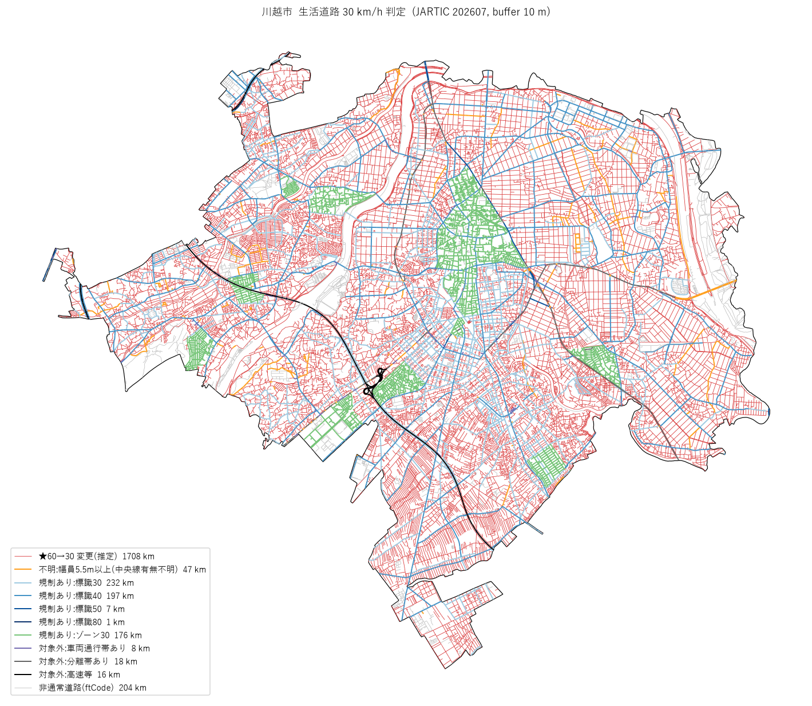

# japan-legal-speed-30kmh-map — この道、60キロ→30キロ？

2026年9月1日施行の改正道路交通法施行令で、**中央線・車両通行帯・中央分離帯のいずれもない一般道路の法定速度が 60 km/h から 30 km/h** に引き下げられました。全国の一般道の約7割が対象とされていますが、どの道路が対象かを示す公式の地図はありません。

このリポジトリは、**国土地理院のベクトルタイル（道路の幅員・分離帯）** と **JARTIC 交通規制情報（速度標識・ゾーン30）** という2つのオープンデータを突き合わせて、「標識が無く法定速度 60 だった道路のうち、中央線等が無いために 30 に変わった道路」を市町村単位で**推定**し、地図で見られるようにするものです。

> **推定であって、確定ではありません。** 中央線そのもののオープンデータは実質存在しないため、幅員 5.5 m 未満を「中央線なし」の代替指標にしています。幅員 5.5 m 以上の道路は中央線の有無を判定できず「不明」と表示します。標識の現地確認に代わるものではありません。

道路に詳しくない人向けに、法改正の中身・使ったデータ・推定の考え方・数字の読み方をまとめた **[この地図の前提と限界](docs/premise.md)** を用意しています。 出てくる言葉は **[用語集](docs/glossary.md)** にまとめています。

## 地図

**https://shiwaku.github.io/japan-legal-speed-30kmh-map/**

`viewer/`（Vite + TypeScript + MapLibre GL JS + PMTiles。[dm-converter/viewer](https://github.com/shiwaku/dm-converter/tree/main/viewer) と同じ構成）。エリアをプルダウンで切り替え、**「判定 / 改正前の速度 / 改正後の速度」**をタブ（または <kbd>B</kbd> キー）で切り替えられます。改正前は標識の無い一般道が一様に 60 km/h（青）で、改正後にその大半が 30 km/h（赤）に変わるのが見えます。凡例のチェックで表示クラスを絞り、道路をクリックすると判定根拠（改正前後の速度・幅員区分・規制の重なり率）が出ます。



## 用語

よく使う 3 語だけここに。ほかは [用語集](docs/glossary.md)。

- **車道**: 地理院ベクトルタイルの道路中心線のうち、軽車道・徒歩道・庭園路（幅 3 m 未満で主に人や自転車が使う道。地物コード 2711〜2731）を除いたもの。自動車が通れる幅の道路のことで、割合の分母に使う。**地図上の形の区分であって法律上の区分ではなく、私道・農道・林道も含む**（下の「道路法上の道路」はその部分集合）。地理院の分類名は「通常部」（コード 2701〜2704）
- **道路法上の道路**: 国道・都道府県道・市区町村道。私道・農道・林道は含まない。国の道路統計はこの範囲で集計されている
- **対象道路**: 中央線・車両通行帯・中央分離帯のいずれもない一般道路（法定速度が 60→30 になる構造の道路）。標識があれば速度は変わらない

## 判定ロジック

法改正で変わったのは「標識が無く法定速度 60 だった道路のうち、中央線等がないもの」だけです。既存の 30/40/50 標識がある道路は標識の速度が優先され、何も変わりません。

```
① 地理院ベクトルタイル road レイヤー（道路中心線 ftCode 2701–2704）
     rnkWidth ≤ 1（幅員 5.5 m 未満） かつ medSect == 0（分離帯なし）
     かつ motorway != 1 かつ rdCtg != 3（高速等でない）           → 候補
     rnkWidth ∈ {2,3,4}（5.5 m 以上）                              → 不明（中央線有無を判定できない）
② JARTIC 交通規制情報
     最高速度（線, コード 112/61/113）を 10 m バッファ →
       候補線分の長さの 70% 以上がバッファ内                      → 規制あり（標識 XX）
     最高速度（面, コード 114 = ゾーン30）に 50% 以上内包           → 規制あり（ゾーン30）
     車両通行帯（16/17/20/21/118）・中央線（15）も同様に            → 対象外
③ 残った候補                                                        → ★60→30 変更（推定）
```

②を「交差」ではなく**重なり率**で判定するのは、規制のある幹線に接続する脇道が端点だけでバッファに引っかかり、全部「規制あり」に化けてしまうためです。川越市では候補道路の重なり率が「0」か「0.9 以上」に二極化し、曖昧帯（0.3〜0.7）は 3% でした。バッファ幅 5/10/15/20 m で結果は 66→63% と安定しています。

改正前後の速度は `speed_before_after` で付与します（標識・ゾーン30 は前後同じ、変更(推定)は 60→30、幅員 5.5 m 以上は 60→不明(60/30)、分離帯・通行帯ありは 60→60）。判定ロジックは [`scripts/common.py`](scripts/common.py) の `classify_width` / `classify_final` / `speed_before_after` にあり、[`tests/test_classify.py`](tests/test_classify.py) で固定しています。

## 結果

| エリア | 市域内の道路中心線 | ★60→30 変更（推定） | 標識あり | ゾーン30 | 不明（5.5 m 以上） | JARTIC |
|---|---|---|---|---|---|---|
| [川越市](areas/kawagoe.json) | 2,615 km（車道 2,410 km） | **1,708 km（65.3% / 車道の 70.9%）** | 437 km | 176 km | 47 km（1.8%） | 2026-07 |
| [札幌市](areas/sapporo.json) | 10,125 km（車道 8,043 km） | **5,094 km（50.3% / 車道の 63.3%）** | 1,397 km | 235 km | 1,081 km（10.7%） | 2026-07 |

詳細は `out/<area>/summary_final.csv`、属性の分布は `out/<area>/summary_attrs.csv`。

道路法上の道路に換算した割合（`official_road_km` による補正、下限〜上限）:

| エリア | 対象道路（中央線等なし） | 60→30 に変わった | 地理院の市区町村道が道路統計を上回る分 |
|---|---|---|---|
| 川越市 | 83〜88% | 60〜71% | +657 km（+29%） |
| 札幌市 | 56〜68% | 50〜63% | +2,201 km（+42%） |

札幌市は認定路線網図（道路法の認定路線）で線分単位に確認でき、認定路線に乗る線分だけで見ると 60→30 は 55.8%（[notes/2026-09-10_sapporo.md](notes/2026-09-10_sapporo.md)）。記事の「札幌市 35%」は中心部だけの値なので、市全域のこの数字とは比べられない。

### 記事の「約7割」と比べるときの注意

報道の「全国の一般道約 122 万 km のうち約 7 割が対象」は、**道路法上の道路**（国道・都道府県道・市町村道、道路統計の実延長）を分母にした**構造上の対象道路**（中央線・通行帯・分離帯がない）の割合です（道路統計年報 2024 の実延長 1,231,024 km − 高速 9,186 km = 1,221,838 km で、報道の 122 万 km と一致します）。このリポジトリの数字と比べるには 2 点の補正が要ります。

1. **「対象道路」と「速度が変わった道路」は別物。** 対象道路でも既に 30/40 km/h 標識やゾーン30 があれば速度は変わらない。川越の車道 2,410 km のうち、構造的に対象（推定）は 2,116 km（88%）、そこから既規制 408 km を除いた「実際に 60→30」は 1,708 km（71%）。
2. **地理院の中心線は私道・農道・未認定道路も含む。** 川越市の道路統計では市道実延長 1,612 km（2026-04-01）に対し、地理院の市区町村道は 2,270 km で **657 km（29%）多い**。国道・県道はほぼ一致するので、超過分はほぼ道路法適用外の道路。これらは狭く標識も無いので、ほとんどが「60→30 変更」に入っている。

`areas/<key>.json` に `official_road_km`（道路統計の実延長）を書くと、`05` が超過分を「道路法適用外・幅員 5.5 m 未満・規制なし」とみなして分母と分子から引いた値を下限、引かない値を上限として幅で出します。川越では **対象道路 83〜88%、60→30 変更 60〜71%**。記事の 7 割と同じ意味（道路法道路の対象道路）で比べるなら 83〜88% で、全国平均より高い。

道路交通法の法定速度は私道（一般交通の用に供する場所）にも及ぶので、地図からは除いていません。

分母・分子の整理と OSM で私道・農道を切り分ける実験の記録: [notes/2026-09-10_kawagoe_7wari.md](notes/2026-09-10_kawagoe_7wari.md)

## 全国版（47 都道府県）

同じ判定を全国に広げた（[notes/2026-09-11_national.md](notes/2026-09-11_national.md)）。単位は都道府県、分母補正は[道路統計年報 2024](https://www.mlit.go.jp/road/ir/ir-data/tokei-nen/2024/nenpo02.html) の都道府県別実延長。

| | km |
|---|---|
| 地理院の道路中心線（47 県合計） | 2,297,024 |
| うち**車道**（軽車道・徒歩道・庭園路を除いた道路。ftCode 2701–2704） | 1,969,106 |
| 道路統計年報の実延長（道路法上の道路。うち高速 9,186） | 1,231,024 |
| **60→30 に変わった（推定）** | **1,534,635** |

| 割合 | 値 |
|---|---|
| 60→30 変更 / 地理院の車道 | 77.9% |
| 60→30 変更 / 道路法上の道路に換算（下限〜上限） | **65.0〜77.9%** |
| 構造的に対象（幅員 5.5 m 未満・分離帯なし）/ 道路法道路に換算 | 73.7〜83.4% |
| （参考）道路統計年報 表15 の幅員 5.5 m 未満 | 70.8% |

報道の「約 7 割が対象」は道路統計年報の幅員 5.5 m 未満（70.8%）と一致し、このリポジトリの「構造的に対象」（道路法道路に換算 74〜83%）とも整合する。実際に速度が変わったのは、そこから既存の標識・ゾーン規制を除いた 6〜8 割。都道府県別は [out/national/prefectures.md](out/national/prefectures.md)。兵庫県は 40 km/h の区域規制が県面積の 27% を覆い、変更は 48% と全国最低。

全国 PMTiles（Z12–16、間引きなし）は GitHub に置けないサイズなので R2 で配信し、ビューワは `docs/areas.json` の `tiles` に書いた URL を読む。Z9 から作ると東京圏の z9 タイルが 197 万本・38MB になってブラウザが開けないため、全国版は Z12 から（市区町村版は Z9 から）。

### 全国版の作り方

```bash
# 地理院ベクトルタイル提供実験 ZL16 を全国分(216 万タイル 17GB)取得。WSL の ext4 に置く。8 並列で約 6 時間
uv run python scripts/make_tile_download_list.py     # mokuroku から未取得分を列挙(再開時も同じ)
wsl bash scripts/download_tiles_all.sh                # aria2c
# 道路統計年報 2024 表15/19/22/25 (data/official/d_genkyou*.xlsx) → 都道府県別 official_road_km
uv run python scripts/make_pref_official.py
# 47 都道府県を順に 03'(GDAL でタイルディレクトリから抽出) → 04 → 05。約 5 時間。areas/pref_XX.json と県境は自動生成(N03 全国 zip が data/n03/ に要る)
uv run python scripts/run_prefectures.py
# 全国 PMTiles(WSL の tippecanoe、数時間) と 全国集計
wsl bash scripts/06_build_national_pmtiles.sh         # → ~/gsi/japan-legal-speed-30kmh.pmtiles
uv run python scripts/make_national_summary.py --tiles https://<配信先>/japan-legal-speed-30kmh.pmtiles
```

`03_extract_roads_gdal.py` は 01〜03 の代替で、WSL の GDAL（MVT ドライバ）でタイルディレクトリを直接読む（川越で 60 秒 → 3 秒、結果は同一）。市区町村にも `--assign clip` で使える。

## 使い方

```bash
uv sync
uv run python -m unittest discover -s tests

# 1. 市域と交差する地理院ベクトルタイル(ZL16)を列挙  (mokuroku.csv.gz 75MB を初回のみ取得)
uv run python scripts/01_list_tiles.py       --area kawagoe
# 2. タイル取得  (川越: 542 枚 23MB)
uv run python scripts/02_fetch_tiles.py      --area kawagoe
# 3. 道路中心線を取り出して一次判定  (タイル矩形でクリップ→市域でクリップ)
uv run python scripts/03_decode_roads.py     --area kawagoe
# 4. JARTIC 規制を市域で切り出し  (入力は下記の GeoJSONL)
uv run python scripts/04_extract_jartic.py   --area kawagoe --jartic data/jartic/202607
# 5. 重なり率で突合して最終判定。--save で out/<area>/final.* と docs/areas.json を書く
uv run python scripts/05_match_regulation.py --area kawagoe --buffer 10 --save
# 6. PMTiles  (tippecanoe。Windows は WSL2 で)
wsl bash scripts/06_build_pmtiles.sh kawagoe
```

### ビューワ（`viewer/`）

```bash
cd viewer
npm install
npm run dev       # http://localhost:5175/ （public/ の areas.json・tiles/ をそのまま読む）
npm run build     # 型チェック + dist/ 生成
npm run preview   # dist/ を本番と同じ base(/japan-legal-speed-30kmh-map/) で確認
```

`viewer/public/` にビューワが読む静的ファイルを置く。`areas.json`（05 と make_national_summary が書く）、`tiles/<area>.pmtiles`（06）、`municipalities.json` と `tiles/municipalities.pmtiles`（make_municipalities.py → 06_build_municipalities_pmtiles.sh。市区町村別の集計と国土数値情報 N03 の境界）、`pale.json` / `std.json`（make_pale_style）。
main に `viewer/**` の変更が入ると `.github/workflows/deploy-viewer.yml` がビルドして GitHub Pages に配信する。

| 機能 | 内容 |
|---|---|
| エリア | 全国 / 都道府県 / 市区町村をプルダウンで切替。都道府県・全国は R2 の全国 PMTiles、市区町村は `public/tiles/` |
| 市区町村別の色分け | ズーム 12 未満では全国 1,898 地区（政令市は区単位。内訳は下記）を変更率（車道のうち 60→30 になった割合）で塗り分ける。区切りは 60 / 70 / 78 / 84%（実データの分布に合わせた）。ズーム 9 以上では変更率のラベルも出し、12 以上は判定線に入れ替わる |
| 市区町村 | 全国 1,918 件から名前で検索（政令市は市全体と区の両方）。面をクリックしても選べる。選ぶとその範囲へ寄せ、輪郭を強調し、凡例と要約をその市区町村の集計に切り替える（`?area=pref_11&muni=11201`）。要約には全国順位も出す。集計は線分の中点で市区町村に割り当てたもので、道路統計との比較（道路法換算）は都道府県単位のみ |
| 行政区域 | 国土数値情報 N03-20240101 の市区町村境界を線で重ねる（パネル下のチェックで ON/OFF） |
| ホバー | マウスがある環境では、面に触れると市区町村名・車道・変更率を出す |
| 表示 | 判定 / 改正前の速度 / 改正後の速度（<kbd>B</kbd> で前後トグル） |
| 凡例 | 区分ごとに表示 ON/OFF、延長 km を併記。全ON/全OFF。「標識 60 km/h 以上」のように引き下げと関係のない区分は 1 行にまとめる（細かい区分はクリックしたときのポップアップで出る） |
| 背景 | 淡色 / 標準（地理院 最適化ベクトルタイル）/ 写真（地理院 全国最新写真）/ 白図 |
| テーマ | ライト / ダーク。初回は OS 設定、以降は localStorage |
| スマホ | 640px 以下はボトムシート。初期は畳んで地図を広く。保持タイル数と描画解像度を絞って WebGL コンテキスト消失を防ぐ |
| PWA | manifest + アイコン。Service Worker は index.html だけネットワーク優先（Pages の 10 分キャッシュ対策）、タイルには介入しない |

### JARTIC 交通規制情報の用意

配布形式（1 都道府県 1 zip・170 列 CSV・cp932）をそのまま扱うのは大変なので、[jartic-traffic-regulation-converter](https://github.com/shiwaku/jartic-traffic-regulation-converter) でパースした GeoJSONL を入力にします。

```bash
# converter リポジトリで
python3 src/jartic_opendata_kisei_dl.py --out work/zip --only R11      # 埼玉のみ。省略で 47 都道府県 (320MB)
python3 src/parse_regulation.py --zip-dir work/zip --out work
# regulation_speed.geojsonl と regulation_lane.geojsonl を data/jartic/<yyyymm>/ に置く
```

### 新しいエリアを追加する

1. `areas/<key>.json` を作る（`areas/kawagoe.json` を写す）。`epsg` は長さを測る平面直角座標系（例: 札幌 = XII 系 6680）、`boundary_url` は市域 GeoJSON の URL（無ければ `data/areas/<key>/boundary.geojson` を直接置く。政令市は geoshape に市全体が無いので国土数値情報 N03 の区を結合する）
2. **`official_road_km` に道路統計の実延長（国道・都道府県道・市区町村道、出典 URL、基準日）を必ず書く。** 市の「道路の概要」「道路現況」「統計書」にある。無いと `05` は止まる（`tests/test_areas.py` でも検査）。地理院中心線は私道・農道を含むので、これが無いと全国統計と比べられない
3. 上の 1〜6 を `--area <key>` で回す。`docs/areas.json` にエリアが追記され、ビューワのプルダウンに出る

## ディレクトリ構成

```
areas/<key>.json            エリア定義（名称・EPSG・市域の URL・初期表示位置）
scripts/
  common.py                 パス規約と判定ロジック（ここだけテストされる）
  01_list_tiles.py … 06_build_pmtiles.sh
  make_pale_style.py        地理院 最適化ベクトルタイル std.json → 淡色スタイル viewer/public/pale.json
  make_municipalities.py    市区町村別集計 viewer/public/municipalities.json と境界・代表点 data/n03/municipalities{,_points}.fgb
                            集計単位は 1,898 地区（市区町村 1,741 ＋ 北方領土 6 村 − 政令市 20 ＋ 政令市の区 171）
                            政令市全体 20 も別に持つので JSON は 1,918 件。所属未定地（XX000）は除外
  06_build_municipalities_pmtiles.sh  上記 → tiles/municipalities.pmtiles（面 muni + 代表点 muni_pt の 2 レイヤー、Z4–12）
tests/test_classify.py
data/
  areas/<key>/              boundary.geojson, tiles_z16.csv（コミット）, jartic_*.geojson（04 の出力、ignore）
  gsi/                      mokuroku.csv.gz, tiles/<key>/*.pbf（ignore）
  jartic/<yyyymm>/          converter の GeoJSONL（ignore）
out/<key>/                  roads_z16.parquet, roads_city.geojson, final.{parquet,geojson}（ignore）
                            summary_*.csv, final.png（コミット）
viewer/                     ビューワ（Vite + TS）。public/ に areas.json, municipalities.json, tiles/<key>.pmtiles, tiles/municipalities.pmtiles, pale.json, std.json
docs/                       premise.md（前提と限界）, glossary.md（用語集）
```

## 実データで分かったこと

計画時の想定と違っていた点。他のエリアでも同じ罠を踏まないためのメモ。

- **地理院ベクトルタイルの `motorway` は 99% が 9（不明）**。「`motorway == 0` で一般道に絞る」と全滅する。`== 1` だけを除外する
- **`rnkWidth` の 5（その他）/6（不明）は川越では 0 km**。判定不能率の懸念は都市部では杞憂だった。分布は 3 m 未満 38% / 3〜5.5 m 50% / 5.5〜13 m 10%
- **`Width`（実幅員）は ZL16 タイルに入っていない**。`rnkWidth`（区分）のみ
- road レイヤーには **ftCode 2201（道路縁）が混在**する（件数の約 3 割）。27xx で絞る
- タイルにはバッファが付くので、隣接タイルで同じ道路が二重に入る。延長を出すなら**タイル矩形でクリップ**してから集計する
- **JARTIC の都道府県コードは JIS と異なる**（埼玉 = 12、JIS は 11）。コードでなく空間で絞る
- 埼玉県警は**コード 15「道路の中央線」を提供していない**（16「中央線の変移」のみ）。JARTIC 全国でも 1,048 件・22 都道府県で、中央線の代替には使えない
- **ゾーン30 はコード 114（面）**。線の差分だけでは残るので面内包で除外する（川越で 176 km）
- 2025-07 と 2026-07 の規制データで川越の速度規制は件数・延長ともほぼ同一。施行前の駆け込み標識設置は見られない

## 限界

- 幅員 5.5 m 以上で中央線がない道路（住宅地の 6 m 道路など）は「不明」になる。OSM の `lanes` などで補える可能性はあるが未実装
- 幅員 5.5 m 未満でも中央線が引かれている道路は、原理的に検出できない
- 多車線の一方通行（車両通行帯あり）は 30 にならないが、JARTIC の通行帯データでしか拾えない
- 地理院ベクトルタイルは提供実験中で、URL や属性が変わる可能性がある
- JARTIC の速度規制（線・面）は 47 都道府県すべてが提供しているが、各県の網羅性は未検証。速度規制の延長は道路統計の実延長の 20%（大阪 52%〜茨城 11%）で、漏れがあれば「規制なし → 60→30 変更」側に判定される。車両通行帯は 40 県、中央線は 22 県のみ提供

## データ出典・ライセンス

- 国土地理院 [ベクトルタイル提供実験](https://github.com/gsi-cyberjapan/gsimaps-vector-experiment)（`experimental_bvmap`、属性仕様は [attribute.pdf](https://maps.gsi.go.jp/help/pdf/vector/attribute.pdf)）— [国土地理院コンテンツ利用規約](https://www.gsi.go.jp/kikakuchousei/kikakuchousei40182.html)
- [JARTIC 交通規制情報](https://www.jartic.or.jp/service/opendata/)（拡張版標準フォーマット k_2.1）— JARTIC オープンデータ利用規約
- 市域: [geoshape.ex.nii.ac.jp 行政区域データ](https://geoshape.ex.nii.ac.jp/city/)（川越）、[国土数値情報 行政区域 N03-20240101](https://nlftp.mlit.go.jp/ksj/gml/datalist/KsjTmplt-N03-2024.html)（札幌、10 区を結合）
- 道路統計（全国版）: [国土交通省 道路統計年報 2024 道路の現況 表15/19/22/25](https://www.mlit.go.jp/road/ir/ir-data/tokei-nen/2024/nenpo02.html)（`data/official/`）、県境・市区町村境界（ビューワの行政区域表示・市区町村別集計）: [国土数値情報 N03-20240101（全国）](https://nlftp.mlit.go.jp/ksj/gml/datalist/KsjTmplt-N03-2024.html)
- 道路統計: 川越市[「道路の概要」](https://www.city.kawagoe.saitama.jp/kurashi/kotsu/1003125/1003150.html)、札幌市[「札幌の交通・道路 2023」](https://www.city.sapporo.jp/sogokotsu/date/2023/documents/2023-01_road.pdf)
- [札幌市認定路線網図](https://ckan.pf-sapporo.jp/dataset/sapporo_authorized_road)（CC BY 4.0、道路法の認定路線・幅員つき）
- 背景地図: [国土地理院 最適化ベクトルタイル](https://github.com/gsi-cyberjapan/optimal_bvmap)（`optimal_bvmap-v1` PMTiles）。標準スタイル `std.json` を `scripts/make_pale_style.py` で淡色化した `docs/style/pale.json` で描画。スプライト・グリフは地理院のものを参照

コードは Apache License 2.0（[LICENSE](LICENSE)）。`viewer/public/tiles/*.pmtiles`・全国 PMTiles と `out/` の集計は上記データの派生物で、それぞれの利用規約に従います。
